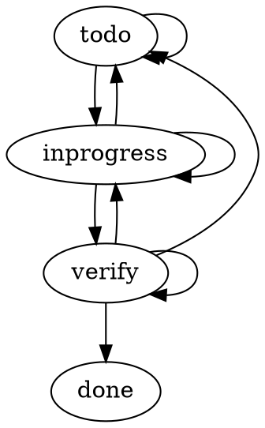

# Yet Another Finite State Machine

### A toy, DO NOT USE IN PRODUCTION.


### Examples:

- Creating a transition handler

```go
const (
    green  yafsm.State = "green"
    yellow yafsm.State = "yellow"
    red    yafsm.State = "red"
)
handler := yafsm.CreateTransitionHandler([]yafsm.Transition{
    yafsm.NewTransition(yafsm.NewStates(red), green),
    yafsm.NewTransition(yafsm.NewStates(green), yellow),
    yafsm.NewTransition(yafsm.NewStates(yellow), red),
})

err := handler(green, red)
if err != nil {
    fmt.Println(err)
}

err := handler(green, yellow)
if err == nil {
    fmt.Println("Yay~")
}
```

- Creating a DOT string from list of transitions

```go
const (
    todo       yafsm.State = "todo"
    inprogress yafsm.State = "inprogress"
    verify     yafsm.State = "verify"
    done       yafsm.State = "done"
)
transitions := []yafsm.Transition{
    yafsm.NewTransition(yafsm.NewStates(todo, inprogress, verify), todo),
    yafsm.NewTransition(yafsm.NewStates(todo, inprogress, verify), inprogress),
    yafsm.NewTransition(yafsm.NewStates(inprogress, verify), verify),
    yafsm.NewTransition(yafsm.NewStates(verify), done),
}

dot := yafsm.CreateDOTString(transitions)
fmt.Println(dot)
```

Output:


